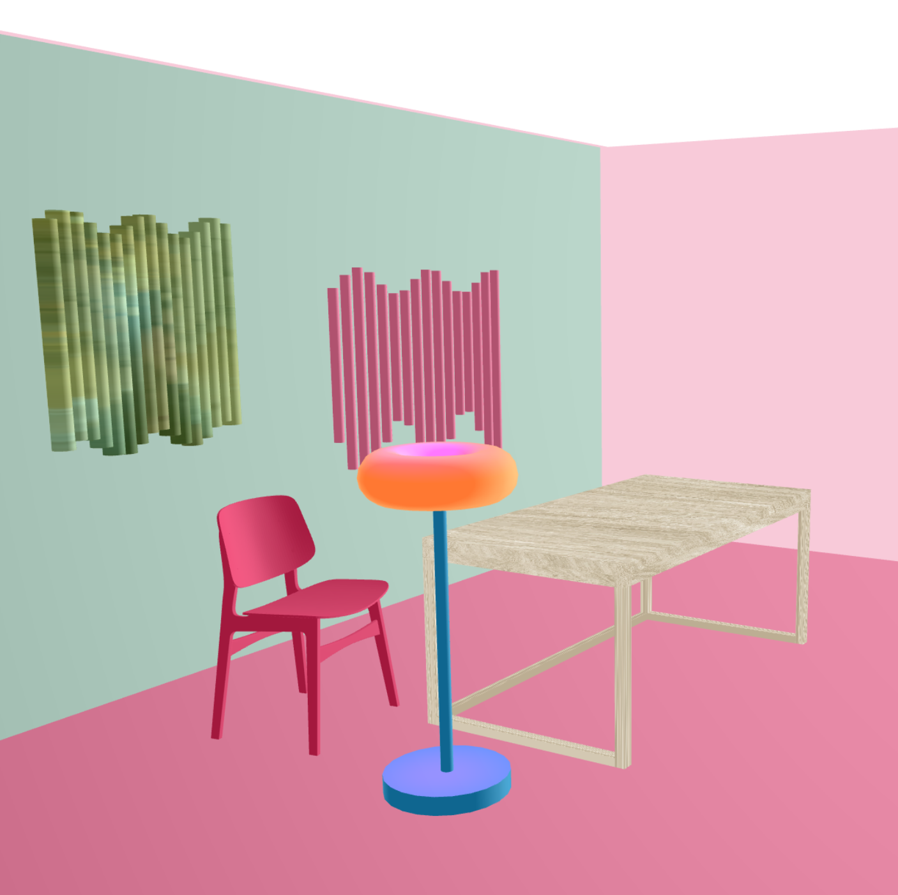

# Kinetic Sculpture Workshop

## GitHub API / NewsApi.org Retrieval

## 3D Studio

[Link to project online](https://3d-p5-studio.vercel.app)
[On the P5 Web Editor](https://editor.p5js.org/ineslucas/sketches/rl2syy253)

## Examples & Resources
[Danny Rozin BodyPix Webcam](https://editor.p5js.org/dannyrozin/sketches/RUwyKl9Tw)
[Vitra Downloads](https://downloads.vitra.com/media?search=box&per_page=25)
[Ray's sketch for Torus with Effects](https://editor.p5js.org/RayRayRule/sketches/wFzQ6bNJS)

